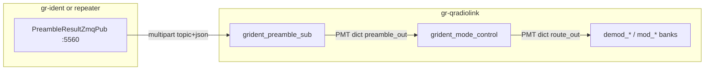

# gr-qradiolink Code and Function Map

This document indexes source files and public APIs so you can navigate from a feature (for example gr-ident mode routing) to the implementing code. Operational wiring for gr-ident is in [GRIDENT_ZMQ.md](GRIDENT_ZMQ.md).

**Branch note:** Paths under `include/gnuradio/qradiolink/` and `lib/` apply to **`main`** (GNU Radio 3.10). The experimental GR4 port on branch **`gnuradio4`** mirrors the same gr-ident logic under `gnuradio4/include/gnuradio-4.0/qradiolink/` (see [GR4 gr-ident section](#gnu-radio-4-branch-gnuradio4) below).

---

## Table of contents

1. [gr-ident ZMQ mode routing (GNU Radio 3.10)](#gr-ident-zmq-mode-routing-gnu-radio-310)
2. [GNU Radio 4 branch (`gnuradio4`)](#gnu-radio-4-branch-gnuradio4)
3. [Modulation and demodulation blocks](#modulation-and-demodulation-blocks)
4. [DSSS / GDSS](#dsss--gdss)
5. [Digital voice and MMDVM](#digital-voice-and-mmdvm)
6. [FEC and utilities](#fec-and-utilities)
7. [Python bindings and GRC](#python-bindings-and-grc)
8. [Tests](#tests)

---

## gr-ident ZMQ mode routing (GNU Radio 3.10)

Compatible with [gr-ident](https://github.com/Supermagnum/gr-ident) preamble JSON on `tcp://127.0.0.1:5560` ([zeromq-protocol.md](https://github.com/Supermagnum/gr-ident/blob/main/docs/zeromq-protocol.md)).

### Data flow

### File index (`main`)

| File | Role |
|------|------|
| [include/gnuradio/qradiolink/grident_zmq_protocol.h](../include/gnuradio/qradiolink/grident_zmq_protocol.h) | Wire constants, JSON parse/format |
| [include/gnuradio/qradiolink/grident_mode_map.h](../include/gnuradio/qradiolink/grident_mode_map.h) | `mode_id` to `modem_route` and block name |
| [include/gnuradio/qradiolink/grident_mode_control.h](../include/gnuradio/qradiolink/grident_mode_control.h) | Public GR block API |
| [lib/grident_mode_control_impl.h](../lib/grident_mode_control_impl.h) | Mode control implementation |
| [lib/grident_mode_control_impl.cc](../lib/grident_mode_control_impl.cc) | Message handlers, route PMT publish |
| [include/gnuradio/qradiolink/grident_preamble_sub.h](../include/gnuradio/qradiolink/grident_preamble_sub.h) | ZMQ SUB block API (requires libzmq) |
| [lib/grident_preamble_sub_impl.h](../lib/grident_preamble_sub_impl.h) | ZMQ subscriber thread |
| [lib/grident_preamble_sub_impl.cc](../lib/grident_preamble_sub_impl.cc) | `zmq_poll` loop, forward to message port |
| [grc/qradiolink_grident_mode_control.block.yml](../grc/qradiolink_grident_mode_control.block.yml) | GRC block |
| [grc/qradiolink_grident_preamble_sub.block.yml](../grc/qradiolink_grident_preamble_sub.block.yml) | GRC block |
| [python/qradiolink/bindings/grident_mode_control_python.cc](../python/qradiolink/bindings/grident_mode_control_python.cc) | pybind11 |
| [python/qradiolink/bindings/grident_preamble_sub_python.cc](../python/qradiolink/bindings/grident_preamble_sub_python.cc) | pybind11 (if ZMQ) |
| [tests/test_grident_zmq.cc](../tests/test_grident_zmq.cc) | Protocol and mode-map unit test |

### Namespace `gr::qradiolink::grident`

#### `grident_zmq_protocol.h`

| Symbol | Kind | Description |
|--------|------|-------------|
| `k_preamble_pub_default` | constant | Default RX preamble PUB endpoint (`tcp://127.0.0.1:5560`) |
| `k_tx_control_default` | constant | gr-ident TX PTT endpoint (`tcp://127.0.0.1:5561`, not used for mode set) |
| `k_preamble_topic` | constant | Topic prefix `grident` |
| `k_preamble_topic_prefix` | constant | Per-module topics `grident.A`, etc. |
| `k_tx_topic` | constant | TX control topic `grident.tx` |
| `preamble_result` | struct | `mode_id`, `digital`, `encrypted`, `metadata_present` |
| `topic_matches_preamble(topic)` | function | True for `grident` or `grident.*` |
| `format_preamble_json(r)` | function | Serialize `preamble_result` to gr-ident JSON |
| `parse_preamble_json(json)` | function | Parse JSON body; returns `optional<preamble_result>` |
| `parse_preamble_multipart(topic, json)` | function | Validate topic then parse JSON |
| `detail::extract_field` | function | JSON field extractor (internal) |
| `detail::parse_int_field` | function | Parse integer after field key (internal) |
| `detail::parse_bool_field` | function | Parse `true`/`false` (internal) |

#### `grident_mode_map.h`

| Symbol | Kind | Description |
|--------|------|-------------|
| `modem_route` | enum | Route id for demod/mod family (e.g. `demod_nbfm`, `demod_dmr`) |
| `route_block_name(route)` | function | GR3 factory name string (`demod_nbfm`, `ysf_decoder`, ...) |
| `demod_route_for_mode_id(mode_id)` | function | Map gr-ident mode ID to demod route |
| `mod_route_for_mode_id(mode_id)` | function | Map gr-ident mode ID to mod route |
| `mode_selection` | struct | Preamble + demod/mod routes + `route_valid` |
| `selection_from_preamble(p)` | function | Build `mode_selection` from decoded preamble |
| `selection_from_json(json)` | function | Parse JSON then build selection |

#### Example `mode_id` to demod block (`main`)

| mode_id | Typical gr-ident name | `demod_block` from `route_block_name` |
|---------|----------------------|----------------------------------------|
| 20 | NFM 12.5 kHz | `demod_nbfm` |
| 100 | DMR | `demod_dmr` |
| 104 | C4FM / Fusion | `ysf_decoder` |
| 107 | NXDN | `demod_nxdn` |
| 108 | dPMR | `demod_dpmr` |
| 120 | M17 | `demod_m17` |
| 158 | PSK31 | `demod_bpsk` |
| 159 | RTTY | `demod_2fsk` |

Full mapping logic is in `demod_route_for_mode_id()` / `mod_route_for_mode_id()` in [grident_mode_map.h](../include/gnuradio/qradiolink/grident_mode_map.h).

### GNU Radio blocks

#### `grident_mode_control`

| Method / port | Description |
|---------------|-------------|
| `make()` | Factory |
| `mode_id()`, `digital()`, `encrypted()`, `metadata_present()` | Last decoded preamble fields |
| `route_valid()`, `demod_block()`, `mod_block()` | Routing state |
| Message port `preamble_in` | Accepts PMT symbol (JSON), or dict `{topic, json}`, or `{json}`, or `{preamble_json}` |
| Message port `route_out` | PMT dict: `mode_id`, `digital`, `encrypted`, `metadata_present`, `route_valid`, `active_demod_route`, `active_mod_route`, `demod_block`, `mod_block` |

Implementation methods ([grident_mode_control_impl.cc](../lib/grident_mode_control_impl.cc)):

| Method | Description |
|--------|-------------|
| `handle_preamble_msg(msg)` | Dispatch input PMT to parser |
| `apply_selection(sel)` | Update state and publish `route_out` |
| `make_route_dict()` | Build output PMT dictionary |

#### `grident_preamble_sub` (build with `libzmq`)

| Method / parameter | Description |
|--------------------|-------------|
| `make(endpoint, topic_filter, bind_socket)` | Connect SUB to gr-ident PUB |
| Message port `preamble_out` | PMT dict `{topic, json}` per ZMQ multipart frame |
| `io_loop()` | Background thread: `zmq_poll`, recv topic+body, publish |
| `close_zmq()` | Stop thread and close sockets |

---

## GNU Radio 4 branch (`gnuradio4`)

On branch **`gnuradio4`**, the same protocol and mapping exist as header-only GR4 blocks. File names use PascalCase; namespaces use `gnuradio4::qradiolink::detail`.

| GR3 (`main`) | GR4 (`gnuradio4` branch) |
|--------------|---------------------------|
| `grident_zmq_protocol.h` | `detail/GrIdentZmqProtocol.hpp` |
| `grident_mode_map.h` | `detail/GrIdentModeMap.hpp` (`QrModemRoute`, `qrDemodRouteForModeId`, ...) |
| `grident_mode_control` | `GrIdentModeControl` (`msg_preamble_in`, `msg_route_out`, `applyPreambleZmqFrames`) |
| `grident_preamble_sub` | `GrIdentPreambleSub` (`#ifdef GR_QRAD_GR4_HAVE_ZMQ`) |
| (no GR3 equivalent) | `ModDemodSwitchRx` / `ModDemodSwitchTx` (in-process route switch for QA) |
| `tests/test_grident_zmq.cc` | `gnuradio4/test/qa_GrIdent.cpp` |

GR4 block names in `qrRouteName()` use CamelCase (`DemodNbfm`); GR3 `route_block_name()` uses snake_case (`demod_nbfm`).

---

## Modulation and demodulation blocks

Each mod/demod pair follows the pattern:

| Layer | Path pattern | Typical API |
|-------|--------------|-------------|
| Public header | `include/gnuradio/qradiolink/mod_*.h`, `demod_*.h` | `static sptr make(...)` |
| Implementation | `lib/mod_*_impl.cc`, `lib/demod_*_impl.cc` | `work()`, internal DSP |
| GRC | `grc/qradiolink_mod_*.block.yml` | Flowgraph parameters |
| Python | `python/qradiolink/bindings/mod_*_python.cc` | `bind_*()` |

| Family | Mod header | Demod header |
|--------|------------|--------------|
| 2FSK | [mod_2fsk.h](../include/gnuradio/qradiolink/mod_2fsk.h) | [demod_2fsk.h](../include/gnuradio/qradiolink/demod_2fsk.h) |
| 4FSK | [mod_4fsk.h](../include/gnuradio/qradiolink/mod_4fsk.h) | [demod_4fsk.h](../include/gnuradio/qradiolink/demod_4fsk.h) |
| 8FSK | [mod_8fsk.h](../include/gnuradio/qradiolink/mod_8fsk.h) | [demod_8fsk.h](../include/gnuradio/qradiolink/demod_8fsk.h) |
| GMSK | [mod_gmsk.h](../include/gnuradio/qradiolink/mod_gmsk.h) | [demod_gmsk.h](../include/gnuradio/qradiolink/demod_gmsk.h) |
| BPSK | [mod_bpsk.h](../include/gnuradio/qradiolink/mod_bpsk.h) | [demod_bpsk.h](../include/gnuradio/qradiolink/demod_bpsk.h) |
| QPSK | [mod_qpsk.h](../include/gnuradio/qradiolink/mod_qpsk.h) | [demod_qpsk.h](../include/gnuradio/qradiolink/demod_qpsk.h) |
| SOQPSK | [mod_soqpsk.h](../include/gnuradio/qradiolink/mod_soqpsk.h) | [demod_soqpsk.h](../include/gnuradio/qradiolink/demod_soqpsk.h) |
| CPM-4FSK | [mod_cpm_4fsk.h](../include/gnuradio/qradiolink/mod_cpm_4fsk.h) | (mod only) |
| AM | [mod_am.h](../include/gnuradio/qradiolink/mod_am.h) | [demod_am.h](../include/gnuradio/qradiolink/demod_am.h) |
| SSB | [mod_ssb.h](../include/gnuradio/qradiolink/mod_ssb.h) | [demod_ssb.h](../include/gnuradio/qradiolink/demod_ssb.h) |
| NBFM | [mod_nbfm.h](../include/gnuradio/qradiolink/mod_nbfm.h) | [demod_nbfm.h](../include/gnuradio/qradiolink/demod_nbfm.h) |
| WBFM | [mod_wbfm.h](../include/gnuradio/qradiolink/mod_wbfm.h) | [demod_wbfm.h](../include/gnuradio/qradiolink/demod_wbfm.h) |

Analog demodulators use CESSB-related helpers in `lib/clipper_cc_impl.cc`, `lib/stretcher_cc_impl.cc` where applicable (see QRadioLink origin in [README.md](../README.md)).

---

## DSSS / GDSS

| Topic | Documentation | Key headers |
|-------|---------------|-------------|
| DSSS | [DSSS_BLOCKS.md](DSSS_BLOCKS.md) | [dsss_spreader_cc.h](../include/gnuradio/qradiolink/dsss_spreader_cc.h), [dsss_despreader_cc.h](../include/gnuradio/qradiolink/dsss_despreader_cc.h), [pn_sequence_generator](../include/gnuradio/qradiolink/) (in lib) |
| GDSS | [GDSS_BLOCKS.md](GDSS_BLOCKS.md) | [gdss_spreader_cc.h](../include/gnuradio/qradiolink/gdss_spreader_cc.h), [gdss_despreader_cc.h](../include/gnuradio/qradiolink/gdss_despreader_cc.h) |
| CDMA | README / GRC | [dsss_cdma_transmitter_cc.h](../include/gnuradio/qradiolink/dsss_cdma_transmitter_cc.h), [dsss_cdma_receiver_cc.h](../include/gnuradio/qradiolink/dsss_cdma_receiver_cc.h) |

---

## Digital voice and MMDVM

| Mode / protocol | Mod / encoder | Demod / decoder | Notes |
|-----------------|---------------|-----------------|-------|
| M17 | [m17_coder.h](../include/gnuradio/qradiolink/m17_coder.h), [mod_m17.h](../include/gnuradio/qradiolink/mod_m17.h) | [m17_decoder.h](../include/gnuradio/qradiolink/m17_decoder.h), [demod_m17.h](../include/gnuradio/qradiolink/demod_m17.h) | [m17_deframer.h](../include/gnuradio/qradiolink/m17_deframer.h), libm17 in `libm17/` |
| DMR | [mod_dmr.h](../include/gnuradio/qradiolink/mod_dmr.h) | [demod_dmr.h](../include/gnuradio/qradiolink/demod_dmr.h) | |
| dPMR | [mod_dpmr.h](../include/gnuradio/qradiolink/mod_dpmr.h) | [demod_dpmr.h](../include/gnuradio/qradiolink/demod_dpmr.h) | |
| NXDN | [mod_nxdn.h](../include/gnuradio/qradiolink/mod_nxdn.h) | [demod_nxdn.h](../include/gnuradio/qradiolink/demod_nxdn.h) | |
| FreeDV | [mod_freedv.h](../include/gnuradio/qradiolink/mod_freedv.h) | [demod_freedv.h](../include/gnuradio/qradiolink/demod_freedv.h) | Requires GR vocoder + Codec2 |
| POCSAG | [pocsag_encoder.h](../include/gnuradio/qradiolink/pocsag_encoder.h) | [pocsag_decoder.h](../include/gnuradio/qradiolink/pocsag_decoder.h) | |
| D-STAR | [dstar_encoder.h](../include/gnuradio/qradiolink/dstar_encoder.h) | [dstar_decoder.h](../include/gnuradio/qradiolink/dstar_decoder.h) | |
| YSF | [ysf_encoder.h](../include/gnuradio/qradiolink/ysf_encoder.h) | [ysf_decoder.h](../include/gnuradio/qradiolink/ysf_decoder.h) | gr-ident mode 104 routes here |
| P25 | [p25_encoder.h](../include/gnuradio/qradiolink/p25_encoder.h) | [p25_decoder.h](../include/gnuradio/qradiolink/p25_decoder.h) | |
| MMDVM IQ | [mmdvm_source.h](../include/gnuradio/qradiolink/mmdvm_source.h) | [mmdvm_sink.h](../include/gnuradio/qradiolink/mmdvm_sink.h) | ZMQ IPC; see [DEPENDENCIES.md](../DEPENDENCIES.md) |
| MMDVM multi | [mod_mmdvm_multi2.h](../include/gnuradio/qradiolink/mod_mmdvm_multi2.h) | [demod_mmdvm_multi.h](../include/gnuradio/qradiolink/demod_mmdvm_multi.h), [demod_mmdvm_multi2.h](../include/gnuradio/qradiolink/demod_mmdvm_multi2.h) | |

---

## FEC and utilities

| Block | Header | Implementation |
|-------|--------|----------------|
| Interleaver | [interleaver_bb.h](../include/gnuradio/qradiolink/interleaver_bb.h) | [interleaver_bb_impl.cc](../lib/interleaver_bb_impl.cc) |
| 4FSK discriminator | [gr_4fsk_discriminator.h](../include/gnuradio/qradiolink/gr_4fsk_discriminator.h) | [gr_4fsk_discriminator_impl.cc](../lib/gr_4fsk_discriminator_impl.cc) |
| RSSI tag | [rssi_tag_block.h](../include/gnuradio/qradiolink/rssi_tag_block.h) | [rssi_tag_block_impl.cc](../lib/rssi_tag_block_impl.cc) |
| Clipper / stretcher | [clipper_cc.h](../include/gnuradio/qradiolink/clipper_cc.h), [stretcher_cc.h](../include/gnuradio/qradiolink/stretcher_cc.h) | `lib/clipper_cc_impl.cc`, `lib/stretcher_cc_impl.cc` |
| Zero idle bursts | [zero_idle_bursts.h](../include/gnuradio/qradiolink/zero_idle_bursts.h) | [zero_idle_bursts_impl.cc](../lib/zero_idle_bursts_impl.cc) |
| gr-ident mode control | [grident_mode_control.h](../include/gnuradio/qradiolink/grident_mode_control.h) | [grident_mode_control_impl.cc](../lib/grident_mode_control_impl.cc) |

LDPC encoder/decoder blocks are defined under `grc/`; implementations may live in the GR tree or linked modules depending on build configuration.

---

## Python bindings and GRC

| Component | Path |
|-----------|------|
| Bindings entry | [python/qradiolink/bindings/python_bindings.cc](../python/qradiolink/bindings/python_bindings.cc) |
| Per-block binds | [python/qradiolink/bindings/*_python.cc](../python/qradiolink/bindings/) |
| GRC block YAML | [grc/](../grc/) |
| Block tree | [grc/qradiolink.tree.yml](../grc/qradiolink.tree.yml) |

Python module: `gnuradio.qradiolink` (from `qradiolink_python`).

---

## Tests

| Test | Path | Covers |
|------|------|--------|
| gr-ident protocol | [tests/test_grident_zmq.cc](../tests/test_grident_zmq.cc) | JSON parse, mode 104 to `ysf_decoder` |
| Per-block tests | [tests/test_*.cc](../tests/) | Individual mod/demod blocks |
| Boost tests | Listed in [tests/CMakeLists.txt](../tests/CMakeLists.txt) | demod/mod suites, interleaver, RSSI |
| MMDVM Python | [fuzzing-results/results.md](../fuzzing-results/results.md) | Protocol roundtrip |
| Fuzzing | [fuzzing/](../fuzzing/) | libFuzzer harnesses |

Run gr-ident test: `ctest -R test_grident_zmq` or `./tests/test_grident_zmq` from the build directory.
